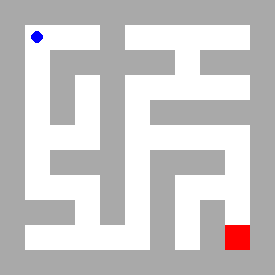
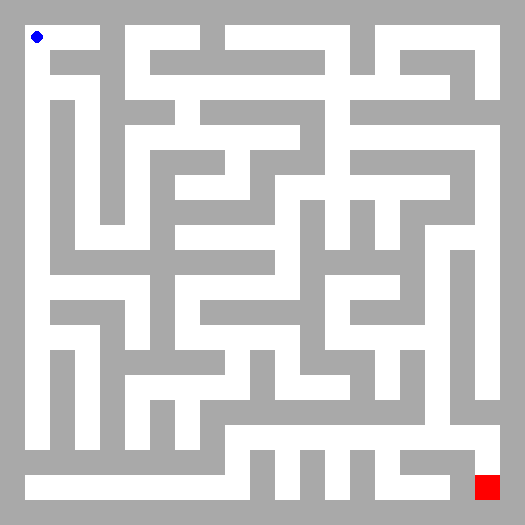
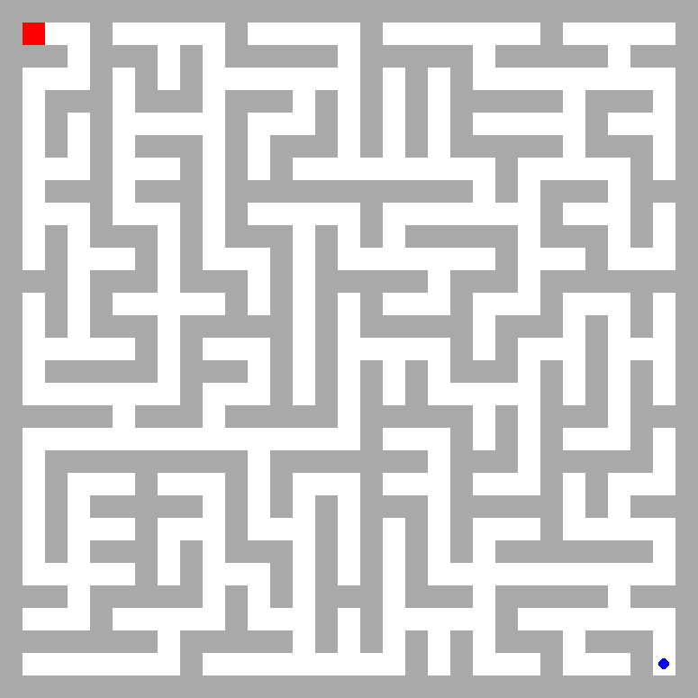
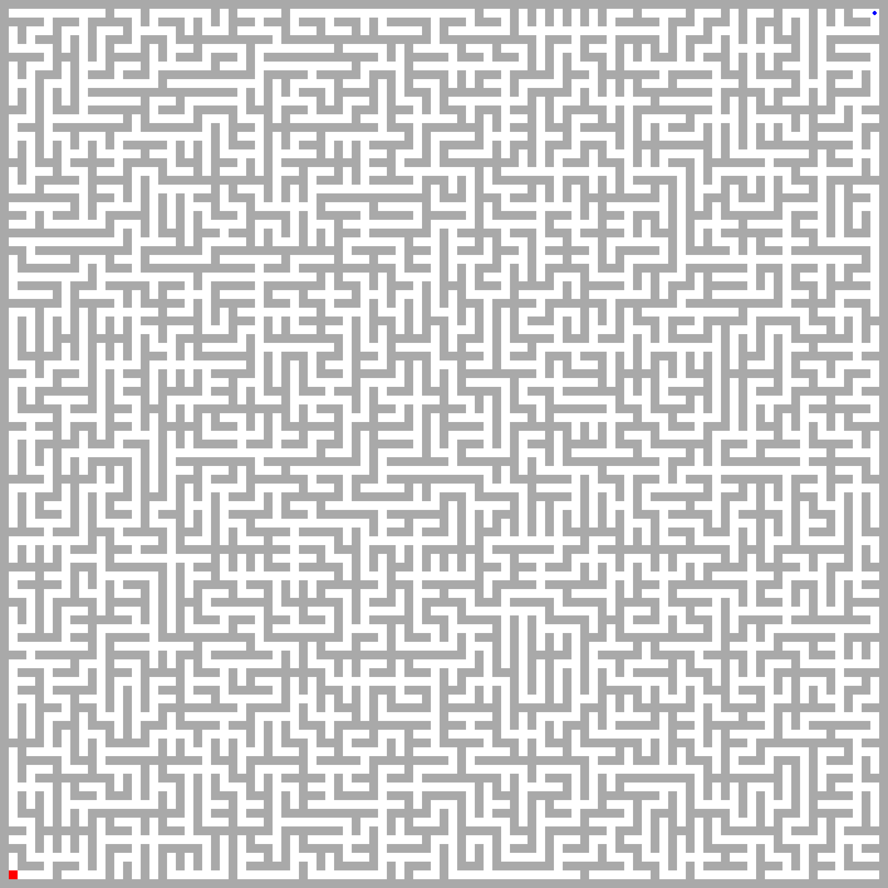

# maze-world

Random maze environments with different size and complexity for reinforcement learning and planning research. This is in-particular to investigate generalization and planning ability in dynamically changing environment.


[](https://colab.research.google.com/github/koulanurag/maze-world/blob/main/examples/colab_example.ipynb)


_Disclaimer: This project is largely a amalgam of references mentioned <a href=#references>here</a>._

## Installation

- Using PyPI:
   ```bash
   pip install maze-world
   ```

- Directly from source (recommended):
   ```bash
   git clone https://github.com/koulanurag/maze-world.git
   cd maze-world
   pip install -e .
   ```
## Environments Zoo!

<div style="text-align:center;">
  <table>
    <tr>
      <td><b>RandomMaze-11x11-v0</b></td>
      <td><b>RandomMaze-21x21-v0</b></td>
      <td><b>RandomMaze-31x31-v0</b></td>
      <td><b>RandomMaze-101x101-v0</b></td>
    </tr>
    <tr>
      <td></td>
      <td></td>
      <td></td>
      <td></td>
    </tr>
  </table>
</div>

See all [here](https://koulanurag.dev/maze-world/environments.html).

## Quick-Start:
```python
import gymnasium as gym

env = gym.make("maze_world:RandomMaze-11x11-v0", render_mode="human")
terminated, truncated = False, False
observation, info = env.reset(seed=0, options={})
episode_score = 0.

while not (terminated or truncated):
    action = env.action_space.sample()
    observation, reward, terminated, truncated, info = env.step(action)
    episode_score += reward

env.close()
```

See entire quick-start guide [here](https://koulanurag.dev/maze-world/quick-start.html).

## Testing:

- Install: ```pip install -e ".[test]" ```
- Run: ```pytest```

## Development:

If you would like to develop it further; begin by installing following:

```pip install -e ".[develop]" ```

## References:
1. [Gym-Maze](https://github.com/MattChanTK/gym-maze)
2. [Mazelab](https://github.com/zuoxingdong/mazelab)
3. [Custom Gym environment based out of gymnasium](https://gymnasium.farama.org/tutorials/gymnasium_basics/environment_creation/)
4. [Wilson Maze Generator](https://github.com/CaptainFl1nt/WilsonMazeGenerator)
